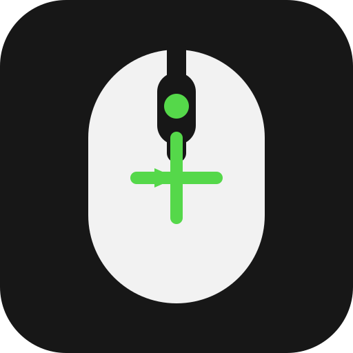

# Custom Mouse

  

  A simple Minecraft Fabric mod for customizing your mouse and crosshair.

**Custom Mouse** is a simple Minecraft mod that lets you change your mouse and crosshair settings from inside the game.

You do **not** need to know how Minecraft modding works to use this mod. Just follow the steps below.

## What does this mod do?

Once installed, press **P** in Minecraft to open the **Custom Mouse** menu.

From there you can:

- Change your mouse sensitivity
- Toggle inverted mouse Y
- Change the crosshair colour
- Change the crosshair size
- Change the crosshair thickness
- Change the gap in the crosshair
- Use a custom Windows cursor (.cur or .ani)

Your settings apply while Minecraft is running.

## What do I need?

This mod is made for:

- **Minecraft Java Edition 1.21.11**
- **Fabric**
- **Fabric API**

You need Fabric and Fabric API installed before using this mod.

> **Important:** Make sure you use the correct Minecraft version and Fabric mod loader. This mod is not made for Forge or NeoForge.

## How to install the mod

### Prism Launcher

If you use Prism Launcher, this is the easiest way:

1. Open **Prism Launcher**.
2. Select your Minecraft **1.21.11 Fabric** instance.
3. Click **Edit**.
4. Open the **Mods** tab.
5. Click **Add File**.
6. Select the custom-mouse-1.0.0.jar file.
7. Make sure **Fabric API** is also installed.
8. Start Minecraft.

### Normal Minecraft Launcher

1. Install **Fabric** for Minecraft 1.21.11.
2. Download **Fabric API** for Minecraft 1.21.11.
3. Find your Minecraft mods folder.
4. Put custom-mouse-1.0.0.jar and the Fabric API .jar file inside it.
5. Start Minecraft using the **Fabric** profile.

On Windows, the normal mods folder is:

    %appdata%\\.minecraft\\mods

> **Tip:** If you are not sure where your mods folder is, press **Windows + R**, paste the path above, and press Enter.

## How to use it

1. Start Minecraft.
2. Join a world or server.
3. Press **P**.
4. The **Custom Mouse** menu will open.
5. Change the settings you want.
6. Press **Done** when you are finished.

## Building the mod yourself

This section is only for people who want to change the source code or build their own copy.

### You need

- **Java 21**
- The source code from this repository

### Build

Open a terminal in the project folder and run:

    gradlew.bat build

When the build finishes, open:

    build/libs/

You should find:

    custom-mouse-1.0.0.jar

That .jar file is the mod you can put into your Minecraft mods folder.

## Troubleshooting

### The mod does not appear in Minecraft

Check that:

- You are using **Minecraft Java Edition 1.21.11**.
- You are running **Fabric**, not Forge or NeoForge.
- Fabric API is installed.
- custom-mouse-1.0.0.jar is inside the correct mods folder.
- You installed the .jar file, not the GitHub source-code ZIP.

### Pressing P does nothing

Make sure you are in-game and not already typing in chat or using another screen.

Also check that another mod is not using the **P** key.

### Minecraft crashes

Check that your mods are made for **Minecraft 1.21.11** and **Fabric**.

If you still have a problem, open an issue in this GitHub repository and include your crash report or latest log.

## For developers

Custom Mouse is a **client-side Fabric mod**.

This means the mod changes things on your Minecraft client. You do not normally need to install it on a Minecraft server just to use the client features.

The source code is written in Java and uses Fabric's modding tools.

## Credits

Made by **lmslickolster**.

Thanks to the Fabric project for the modding tools and documentation.
